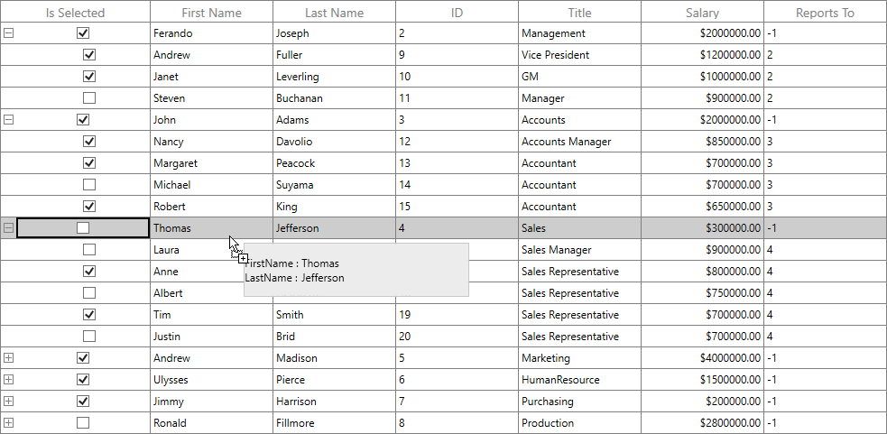

# How to show corresponding dragging row data in draggable popup in WPF TreeGrid (SfTreeGrid)? 

## About the sample
This example illustrates how to show corresponding dragging row data in draggable popup in [WPF TreeGrid](https://www.syncfusion.com/wpf-controls/treegrid) (SfTreeGrid)? 

[WPF TreeGrid](https://www.syncfusion.com/wpf-controls/treegrid) (SfTreeGrid) displays the **RowCount** and **DropStatus** in a draggable popup while drag-and-drop operation. You can customize the dragging popup to show the corresponding drag row data by customizing the [RowDragDropTemplate](https://help.syncfusion.com/cr/wpf/Syncfusion.UI.Xaml.TreeGrid.SfTreeGrid.html#Syncfusion_UI_Xaml_TreeGrid_SfTreeGrid_RowDragDropTemplateProperty) with binding the data from the [DraggingNodes](https://help.syncfusion.com/cr/wpf/Syncfusion.UI.Xaml.TreeGrid.DragInfo.html#Syncfusion_UI_Xaml_TreeGrid_DragInfo_DraggingNodes) property. 

```XML

<Window.Resources>
        <DataTemplate x:Key="dragdroptemplate">
            <Border x:Name="border" Width="250"    
                    Background="#ececec"   
                    BorderBrush="#c8c8c8"  Height="60"  
                    BorderThickness="1.2">
                <Grid  VerticalAlignment="Center" HorizontalAlignment="Left">
                    <Grid.RowDefinitions>
                        <RowDefinition Height="Auto"/>
                        <RowDefinition Height="Auto"/>
                    </Grid.RowDefinitions>
                    <Grid.ColumnDefinitions>
                        <ColumnDefinition Width="Auto"/>
                        <ColumnDefinition Width="Auto"/>
                    </Grid.ColumnDefinitions>
                    <TextBlock Text="FirstName : " Grid.Row="0" Grid.Column="0" />
                    <TextBlock Text="{Binding DraggingNodes[0].Item.FirstName}" Grid.Row="0" Grid.Column="1"/>
                    <TextBlock Text="LastName : " Grid.Row="1" Grid.Column="0"/>
                    <TextBlock Text="{Binding DraggingNodes[0].Item.LastName}" Grid.Row="1" Grid.Column="1"/>
                </Grid>
            </Border>
        </DataTemplate>
</Window.Resources>

<syncfusion:SfTreeGrid Name="treeGrid"
                               AutoGenerateColumns="False"
                               AllowEditing="True"                               
                               ChildPropertyName="ReportsTo"
                               ParentPropertyName="ID"                               
                               SelfRelationRootValue="-1"
                               ItemsSource="{Binding Employees}"
                               RowDragDropTemplate="{StaticResource dragdroptemplate}"
                               AllowDraggingRows="True"
                               AllowDrop="True" />

```


The following screenshot shows customizing draggable Popup to show corresponding dragging row data in [WPF TreeGrid](https://www.syncfusion.com/wpf-controls/treegrid) (SfTreeGrid),



Take a moment to peruse the [WPF TreeGrid - drag and drop row](https://help.syncfusion.com/wpf/treegrid/interactive-features#drag-and-drop-row) documentation, where you can find about drag and drop row with code examples.

Please refer this [link](https://www.syncfusion.com/wpf-controls/treegrid) to know about the essential features of WPF TreeGrid.

## Requirements to run the demo
Visual Studio 2015 and above versions
